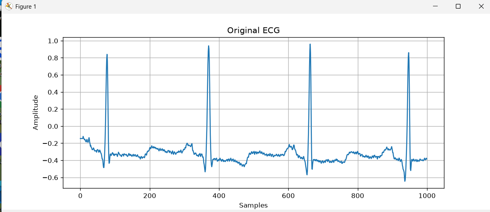
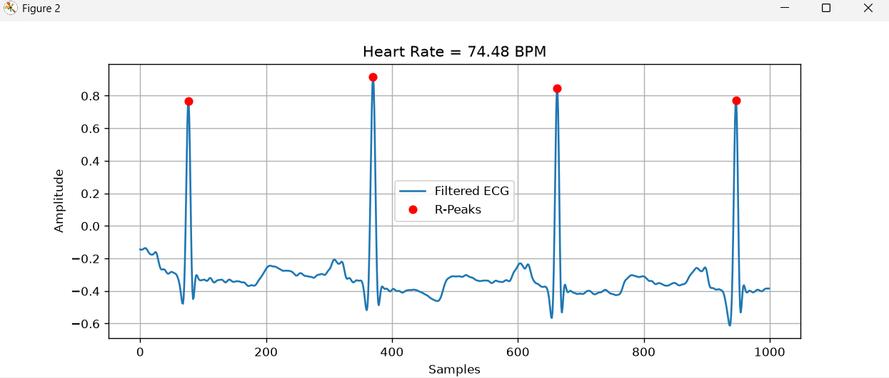
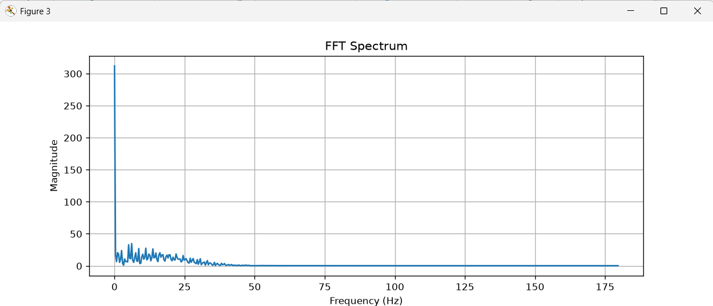

# ECG Signal Analyzer

## Overview

This project analyzes real ECG signals from the **MIT-BIH Arrhythmia Database** using Python and Digital Signal Processing (DSP) techniques.

The application:
- Reads real ECG signals
- Filters noise using a Butterworth Low-Pass Filter
- Detects R-peaks automatically
- Calculates Heart Rate (BPM)
- Performs Fast Fourier Transform (FFT)
- Visualizes ECG signals and frequency spectrum

---

## Features

- Read real ECG data
- Butterworth Low-Pass Filtering
- Automatic R-Peak Detection
- Heart Rate (BPM) Calculation
- FFT Analysis
- ECG Visualization
- Frequency Spectrum Visualization

---

## Technologies Used

- Python
- NumPy
- SciPy
- Matplotlib
- WFDB

---

## Dataset

MIT-BIH Arrhythmia Database (Record 100)

---

## Results

- Heart Rate: **74.48 BPM**
- Detected Beats: **4**
- Sampling Frequency: **360 Hz**
- Successful R-Peak Detection
- FFT Spectrum Generated

---

## Project Structure

```text
ECG-Signal-Analyzer
│
├── main.py
├── requirements.txt
├── README.md
└── screenshots
    ├── original_ecg.png
    ├── filtered_ecg.png
    └── fft_spectrum.png
```

---

## Screenshots

### Original ECG



---

### Filtered ECG with R-Peaks



---

### FFT Spectrum



---

## How to Run

### Install dependencies

```bash
pip install -r requirements.txt
```

### Run the program

```bash
python main.py
```

---

## Author

**Iyappan E**

Electronics and Communication Engineering (ECE)

Python | Digital Signal Processing | Biomedical Signal Processing
